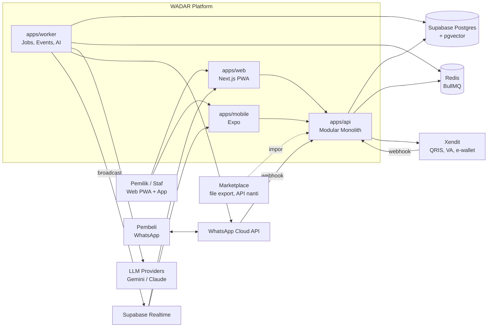
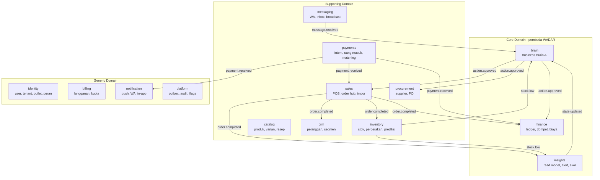
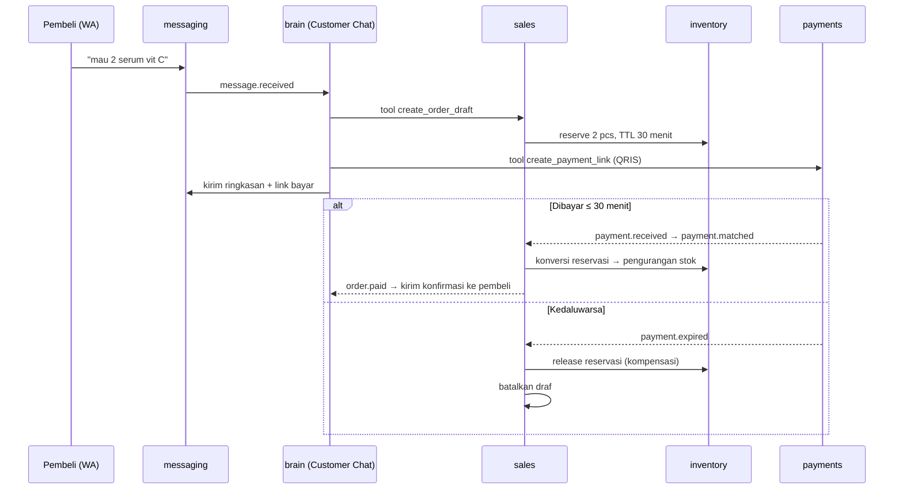
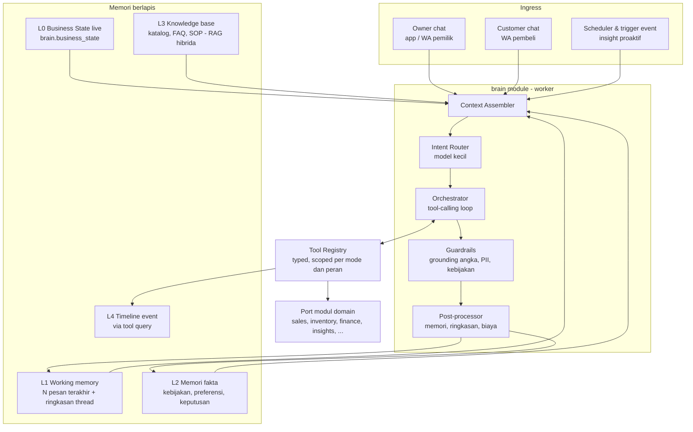

# ARCHITECTURE — WADAR
### Realisasi teknis PRD: bounded context, komunikasi, data, AI Business Brain, resilience, dan deployment

| Meta | Isi |
|---|---|
| Versi | 1.0 |
| Pasangan | `PRD.md` (apa & kenapa) · dokumen ini (bagaimana) · `BUILD-PLAN.md` (urutan build) |
| Gaya arsitektur | **Modular monolith yang siap dipecah jadi microservices** (event-driven, database-per-module) |

---

## 1. Keputusan Arsitektur Utama (ADR ringkas)

| ADR | Keputusan | Alasan | Konsekuensi |
|---|---|---|---|
| 001 | **Mulai sebagai modular monolith** (1 API + 1 worker), bukan microservices penuh | Tim 1–4 orang; microservices di hari pertama = biaya ops, debugging lintas jaringan, dan risiko *distributed monolith*. Batas modul dirancang seperti service sehingga bisa diekstrak nanti | Wajib disiplin batas modul (lint rule), event via outbox, tanpa join lintas modul |
| 002 | **Satu bahasa: TypeScript** di web, mobile, API, worker | Satu stack untuk dikuasai; tipe & validasi dibagi lewat paket bersama | AI/ML berat (jika nanti perlu) boleh jadi service Python terpisah di Fase C |
| 003 | **Monorepo pnpm + Turborepo** | Web & mobile berbagi kontrak API, logika domain, desain token, brand | Build pipeline berbasis cache |
| 004 | **PostgreSQL (Supabase) dengan schema per modul** + pgvector | Satu database dikelola, tapi kepemilikan data per modul tegas (setara database-per-service secara logis) | Tidak ada FK/JOIN lintas schema kecuali ke `identity.tenants` |
| 005 | **Transactional Outbox + BullMQ (Redis)** untuk event | Event tidak hilang walau worker mati; pengiriman at-least-once; konsumen idempoten | Semua handler wajib idempoten (tabel `processed_events`) |
| 006 | **AI tidak pernah menyentuh database langsung** | Keamanan, izin per peran, dan akurasi: AI hanya bisa melakukan apa yang disediakan *tool* bertipe | Setiap kemampuan AI = satu tool eksplisit yang memanggil port modul |
| 007 | **Abstraksi penyedia LLM** (Vercel AI SDK) + routing model | Hindari lock-in, kendalikan biaya, mitigasi kurs | Prompt diuji di >1 model; eval set wajib |
| 008 | **REST + OpenAPI yang dihasilkan dari Zod** (bukan tRPC) | Klien mobile & integrasi pihak ketiga butuh kontrak HTTP standar | Paket `@wadar/contracts` jadi sumber tunggal skema |
| 009 | **Mobile = Expo (React Native)** berbagi paket dengan web | Satu tim bisa rilis Android & iOS; akses notification listener, Bluetooth printer, kamera | Komponen UI web (DOM) dan mobile (native) terpisah, logika & state dibagi |
| 010 | **Uang = bilangan bulat rupiah (BIGINT)**, ledger double-entry | Tidak ada error pembulatan; laporan selalu seimbang | Konversi format hanya di layer tampilan |
| 011 | **ID = UUIDv7** dibuat di klien atau server | Terurut waktu (indeks efisien) & aman untuk offline-first | — |

---

## 2. Gambaran Sistem (Context Diagram)



---

## 3. Bounded Context & Kepemilikan Data

Setiap modul = calon microservice. Aturan: **modul lain hanya boleh memakai `public API` (port) atau event-nya — tidak pernah tabel/repository-nya.**



| Modul (schema) | Data yang dimiliki (tabel inti) | Port sinkron (contoh) | Event diterbitkan |
|---|---|---|---|
| **identity** | `users`, `tenants`, `outlets`, `memberships`, `roles`, `invitations` | `getMembership`, `assertPermission` | `tenant.created`, `member.joined` |
| **catalog** | `products`, `variants`, `categories`, `recipes`, `recipe_items`, `serial_units`, `channel_prices` | `getProducts`, `searchProducts`, `getVariantCost` | `product.created/updated`, `price.changed` |
| **inventory** | `stock_levels`, `stock_movements`, `stock_reservations`, `stocktakes`, `forecasts` | `getStock`, `reserve`, `release`, `forecastStockout` | `stock.changed`, `stock.low`, `stock.out` |
| **sales** | `orders`, `order_lines`, `order_payments`, `channels`, `pos_shifts`, `import_jobs`, `sku_mappings` | `createOrder`, `completeOrder`, `getOrder` | `order.created`, `order.paid`, `order.completed`, `order.cancelled`, `order.returned` |
| **crm** | `customers`, `customer_identities`, `segments`, `tags`, `notes` | `upsertCustomerByPhone`, `getCustomer360` | `customer.created`, `customer.segment_changed` |
| **procurement** | `suppliers`, `purchase_orders`, `po_lines`, `goods_receipts` | `createPO`, `receivePO` | `po.created`, `po.received` |
| **finance** | `wallets`, `accounts`, `journal_entries`, `journal_lines`, `expenses`, `expense_categories`, `receivables`, `payables`, `category_rules` | `recordExpense`, `getBalances`, `getPnL` | `entry.posted`, `expense.recorded`, `receivable.due` |
| **payments** | `payment_intents`, `incoming_payments`, `provider_events`, `match_candidates`, `notification_parses` | `createQrisIntent`, `createPaymentLink` | `payment.received`, `payment.matched`, `payment.expired` |
| **messaging** | `wa_accounts`, `conversations`, `messages`, `templates`, `broadcasts`, `handoffs` | `sendMessage`, `takeOver`, `release` | `message.received`, `conversation.escalated`, `message.delivered` |
| **brain** | `business_state`, `memory_items`, `knowledge_docs`, `knowledge_chunks`, `assistant_threads`, `assistant_messages`, `thread_summaries`, `action_proposals`, `ai_runs` | `ask`, `proposeAction`, `approveAction` | `insight.generated`, `action.proposed`, `action.approved`, `memory.updated` |
| **insights** | `daily_sales_agg`, `daily_product_agg`, `daily_channel_agg`, `cashflow_agg`, `alerts`, `health_scores` | `getSalesSummary`, `getProfitBreakdown`, `getHealthScore` | `alert.raised`, `state.updated` |
| **billing** | `plans`, `subscriptions`, `usage_counters`, `invoices` | `checkEntitlement`, `meter` | `subscription.changed`, `quota.near_limit`, `quota.exceeded` |
| **notification** | `preferences`, `devices`, `deliveries` | `notify` | `notification.sent` |
| **platform** | `outbox`, `processed_events`, `audit_log`, `feature_flags`, `idempotency_keys` | — | — |

**Validasi batas modul (checklist):** setiap modul punya data eksklusif ✓, kontrak publik di `modules/<x>/public.ts` ✓, bisa dideploy terpisah setelah diekstrak (hanya bergantung pada port HTTP + event) ✓.

---

## 4. Pola Komunikasi

### 4.1 Aturan
| Jenis interaksi | Pola | Contoh |
|---|---|---|
| Klien → API | REST `/v1`, JSON, OpenAPI | `POST /v1/orders` |
| Query antar-modul, butuh jawaban < 100 ms | Panggilan sinkron ke **port** (in-process sekarang, HTTP/gRPC setelah diekstrak) | `sales` → `catalog.getVariantCost()` |
| Efek samping lintas modul / lintas aggregate | **Event asinkron** via outbox → BullMQ | `order.completed` → kurangi stok, posting ledger |
| Proses panjang multi-langkah | **Saga orkestrasi** dengan kompensasi | Checkout WA (§4.5) |
| Server → klien realtime | Supabase Realtime **broadcast** channel privat per tenant | Uang masuk + TTS |
| Integrasi keluar (LLM, WA, gateway) | Selalu lewat worker/adaptor dengan timeout, retry, circuit breaker (§8) | — |

### 4.2 Envelope event
```ts
// packages/contracts/src/events/envelope.ts
export const EventEnvelope = z.object({
  id: z.string().uuid(),            // UUIDv7, juga kunci idempotensi
  type: z.string(),                 // "sales.order.completed"
  version: z.number().int(),        // versi skema payload
  tenantId: z.string().uuid(),
  occurredAt: z.string().datetime(),
  correlationId: z.string(),        // dari request awal
  causationId: z.string().optional(), // id event/command pemicu
  actor: z.object({ kind: z.enum(["user","system","ai","webhook"]), id: z.string().optional() }),
  payload: z.unknown(),
});
```

### 4.3 Alur outbox
1. Command handler menulis perubahan domain **dan** baris `platform.outbox` dalam satu transaksi DB.
2. `outbox-relay` (worker, polling 250 ms + `LISTEN/NOTIFY`) mengambil baris `pending` (`FOR UPDATE SKIP LOCKED`) → publish ke antrian BullMQ per konsumen → tandai `published`.
3. Setiap konsumen: cek `processed_events(consumer, event_id)` → jika sudah, skip; jika belum, proses + insert dalam satu transaksi.
4. Gagal → retry eksponensial (5×, maks 10 menit) → masuk **DLQ** + alert.

### 4.4 Katalog event (v1)
| Event | Payload inti | Konsumen |
|---|---|---|
| `sales.order.completed` | orderId, outletId, channel, lines[{variantId, qty, unitPrice, discount}], totals, customerId? | inventory (kurangi stok/bahan resep), finance (posting pendapatan + HPP), crm (update statistik), insights (agregat), brain (state) |
| `sales.order.cancelled` / `returned` | orderId, lines | inventory (kembalikan), finance (reversal) |
| `payments.payment.received` | paymentId, amount, source, reference, receivedAt | finance (posting kas/dompet), sales (matching), notification (push + TTS), brain (state) |
| `payments.payment.matched` | paymentId, orderId | sales (tandai dibayar → `order.paid`) |
| `inventory.stock.changed` | variantId, outletId, delta, onHand, reason | insights, brain (state), messaging (cache stok untuk customer chat) |
| `inventory.stock.low` / `stock.out` | variantId, onHand, daysLeft | insights (alert), brain (insight proaktif), notification |
| `finance.expense.recorded` | expenseId, amount, category, walletId | insights, brain |
| `procurement.po.received` | poId, lines, cost | inventory (tambah stok + HPP rata-rata), finance (persediaan + hutang) |
| `messaging.message.received` | conversationId, customerPhone, text, media? | brain (customer chat), crm (upsert pelanggan) |
| `messaging.conversation.escalated` | conversationId, reason | notification (pemilik/admin) |
| `brain.action.approved` | proposalId, tool, args | modul target via command handler |
| `billing.quota.exceeded` | tenantId, meter | brain (mode customer chat → eskalasi), notification |

### 4.5 Contoh saga: Checkout via WhatsApp


---

## 5. Strategi Data

### 5.1 Prinsip
- **Schema per modul** di satu cluster Postgres (`identity`, `catalog`, `inventory`, `sales`, `crm`, `procurement`, `finance`, `payments`, `messaging`, `brain`, `insights`, `billing`, `notification`, `platform`). User DB aplikasi tidak butuh akses lintas schema untuk query domain; read model lintas domain dibangun di `insights` dari event.
- Setiap tabel domain punya `tenant_id` (NOT NULL, terindeks sebagai kolom pertama indeks komposit).
- **Row Level Security** aktif di semua tabel domain sebagai pertahanan lapis kedua: setiap transaksi API menjalankan `select set_config('app.tenant_id', $1, true)`; policy: `tenant_id = current_setting('app.tenant_id')::uuid`.
- Kolom standar: `id uuid (v7)`, `tenant_id`, `created_at`, `updated_at`, `created_by`, `version int` (optimistic locking), `deleted_at` hanya untuk data master (bukan transaksi).
- Transaksi keuangan & stok **tidak pernah dihapus/diubah** — koreksi lewat entri pembalik (append-only).

### 5.2 Ledger (finance)
- Akun per tenant dibuat dari template saat `tenant.created`: Kas Laci, Bank, E-wallet, Saldo Marketplace, Piutang, Persediaan, Hutang Usaha, Pendapatan Penjualan, Diskon, HPP, Komisi Kanal, Ongkir, Beban (operasional, gaji, sewa, listrik, iklan, lain-lain).
- `journal_entries` (header: tanggal, sumber event, deskripsi) + `journal_lines` (akun, debit, kredit dalam BIGINT). Constraint: trigger *deferred* memastikan Σdebit = Σkredit per entry.
- `wallets` = pandangan ramah pengguna atas akun kas/bank/e-wallet.
- Contoh posting `order.completed` Rp100.000 tunai, HPP Rp60.000: Dr Kas 100.000 / Cr Pendapatan 100.000; Dr HPP 60.000 / Cr Persediaan 60.000.

### 5.3 Stok (inventory)
- `stock_movements` append-only = sumber kebenaran; `stock_levels` = proyeksi (on_hand, reserved, available, avg_cost) diperbarui dalam transaksi yang sama.
- HPP metode **rata-rata tertimbang bergerak**.
- Stok **boleh negatif** (realita POS UMKM) → memicu `stock.out` + alert "stok sistem minus, cek fisik".
- Prediksi habis: laju jual EWMA 14/28 hari per varian + faktor musiman sederhana (tanggal kembar, akhir bulan, Ramadan) → `forecasts(variant_id, daily_rate, days_left, reorder_qty, computed_at)`; dihitung ulang tiap malam + saat `stock.changed` signifikan.

### 5.4 CQRS ringan (insights)
Dasbor dan jawaban AI **tidak** meng-query tabel transaksi mentah. Modul `insights` mengonsumsi event dan memelihara agregat harian per tenant/outlet/produk/kanal (`daily_*_agg`). Hasil: dasbor cepat dan jawaban AI konsisten dengan angka dasbor. Job rekonsiliasi malam membandingkan agregat vs ledger dan menandai selisih.

### 5.5 Penyimpanan lain
- File (foto produk, struk, dokumen KB, ekspor): Supabase Storage, bucket privat per tenant (path `tenant_id/...`), URL bertanda tangan.
- Embedding: `vector(768)` (atau sesuai model) di `brain.knowledge_chunks` & `brain.memory_items`, indeks HNSW + indeks `tsvector` untuk pencarian hibrida.
- Cache: Redis (stok per varian untuk customer chat, business_state terkini, rate limit, sesi idempotensi).

---

## 6. Payment Listener & Realtime

### 6.1 Sumber uang masuk
| Sumber | Mekanisme | Fase |
|---|---|---|
| QRIS dinamis / VA / e-wallet via Xendit | Webhook → verifikasi callback token → `provider_events` (raw, unik per provider_event_id) → `incoming_payments` | MVP |
| Link bayar (customer chat, katalog) | Sama seperti di atas | v1 |
| Notifikasi bank/e-wallet (QRIS statis milik toko) | App Android: *NotificationListenerService* membaca notifikasi aplikasi bank/e-wallet whitelist → parser → `POST /v1/payments/notifications` | v2 (app) |
| Teks notifikasi tempel / forward email mutasi | Parser yang sama di server | v1 |
| Impor mutasi rekening | CSV → parser per bank | P2 |

**Catatan regulasi:** menerima dana **atas nama merchant** harus memakai skema platform/sub-akun gateway (mis. xenPlatform) sehingga dana mengalir ke rekening merchant, bukan ke rekening WADAR. Validasi dengan gateway sebelum MVP.

### 6.2 Parser notifikasi (warisan WADAR)
- Paket `@wadar/payment-parser`: aturan regex berversi per penerbit (BCA, BRI, Mandiri, BNI, GoPay, OVO, DANA, ShopeePay, LinkAja, dll.) → `{amount, sender?, source, reference?, confidence}`.
- Fallback LLM kecil hanya bila regex gagal dan teks mengandung pola nominal; hasil LLM ditandai `confidence<0.9` → butuh konfirmasi pengguna.
- Dedupe: hash(source, amount, timestamp±2 menit, reference).

### 6.3 Realtime ke klien
- Worker mengirim **broadcast** ke channel privat `tenant:{tenantId}` (otorisasi via RLS di `realtime.messages` berdasar membership).
- Pesan: `payment.received` (klien memutar TTS jika perangkat mengaktifkan), `order.updated`, `stock.alert`, `state.updated`, `inbox.message`.
- TTS: Web Speech API `id-ID` di web; `expo-speech` di app; fallback audio pra-render untuk frasa umum. Formatter angka → kata (`@wadar/terbilang`).

---

## 7. AI Business Brain (Pilar 3)

### 7.1 Komponen


### 7.2 "Realtime situasi bisnis": Business State Projector
- Konsumen yang mendengarkan **semua** event domain → memperbarui `brain.business_state` (JSONB per tenant) + cache Redis + broadcast `state.updated`.
- Isi (dibatasi ±600 token saat dirender ke prompt):
  ```json
  {
    "asOf": "2026-09-19T10:05:00+07:00",
    "today": {"revenue": 3450000, "grossProfit": 1210000, "orders": 42, "vsYesterdayPct": 12},
    "cash": {"total": 18250000, "wallets": [{"name":"Kas Laci","balance":1250000}]},
    "stockCritical": [{"name":"Serum Vit C","onHand":6,"daysLeft":3}],
    "ordersPending": {"toPack": 7, "unpaid": 3},
    "inbox": {"escalatedOpen": 2},
    "anomalies": ["Pengeluaran iklan hari ini 3x rata-rata"],
    "upcoming": ["Hutang Supplier A Rp2,1 jt jatuh tempo 21 Sep"]
  }
  ```
- Selalu disisipkan di awal konteks owner assistant → asisten "tahu kondisi sekarang" tanpa perlu tool call untuk pertanyaan ringan. Pertanyaan detail tetap wajib lewat tool.

### 7.3 Memori berlapis
| Lapis | Isi | Penyimpanan | Cara masuk | Cara dipakai |
|---|---|---|---|---|
| L0 | Kondisi bisnis live | `business_state` + Redis | Projector event | Selalu di konteks (owner) |
| L1 | Percakapan berjalan | `assistant_messages`, `thread_summaries` | Otomatis | 12 pesan terakhir + ringkasan bergulir (diperbarui tiap 10 pesan) |
| L2 | Fakta/kebijakan/preferensi/keputusan | `memory_items` (scope: store/owner/customer) | (a) pengguna bilang "ingat…", (b) ekstraksi otomatis pasca-percakapan → status `pending_review` bila keyakinan < 0,8, (c) wawancara onboarding | Retrieval top-k per pesan + semua item `pinned` |
| L3 | Katalog, FAQ, SOP, dokumen | `knowledge_docs`, `knowledge_chunks` | Upload, sinkron katalog via event `product.*` | RAG hibrida (vector + keyword) + rerank |
| L4 | Riwayat kejadian | Tabel domain & agregat | — | Tool `get_timeline`, `get_sales_summary`, dll. |

- Memori pelanggan (scope `customer:{id}`) hanya dipakai di customer chat untuk pelanggan itu (preferensi ukuran, alamat terakhir — dengan persetujuan).
- Konflik memori: item baru yang bertentangan (similaritas tinggi + isi beda) → tandai `superseded` atau minta konfirmasi pemilik (PRD A3.4).
- Semua L2 terlihat & bisa diedit di halaman "Yang WADAR tahu tentang tokomu".

### 7.4 Tool registry
Setiap tool: nama, deskripsi, skema Zod input/output, `mode` (owner | customer | system), `permission`, `sideEffect` (read | write), `requiresApproval`.

| Tool | Mode | Efek | Port yang dipanggil |
|---|---|---|---|
| `get_business_state` | owner | read | brain |
| `get_sales_summary(range, groupBy)` | owner | read | insights |
| `get_profit_breakdown(range, by: product/channel/outlet)` | owner | read | insights |
| `get_cashflow(range)` / `forecast_cash(days)` | owner | read | insights, finance |
| `get_stock(query)` | owner, customer* | read | inventory (*customer: hanya status tersedia/qty terbatas, tanpa HPP) |
| `forecast_stockout(variantIds?)` | owner | read | inventory |
| `search_products(query)` | owner, customer | read | catalog (customer: field publik saja) |
| `get_customer_360(id/phone)` | owner | read | crm |
| `list_orders(filter)` / `get_order_status(ref)` | owner, customer* | read | sales (*customer: hanya pesanannya sendiri) |
| `search_knowledge(query)` | owner, customer | read | brain L3 |
| `record_expense(amount, category, wallet, note)` | owner | write | finance — approval kecuali aturan auto-approve |
| `record_sale_quick(items, method)` | owner | write | sales — approval |
| `create_purchase_order(supplier, lines)` | owner | write | procurement — approval |
| `send_broadcast(segment, template)` | owner | write | messaging — approval |
| `create_order_draft(lines)` | customer | write | sales (tanpa approval, hanya draf + reservasi) |
| `create_payment_link(orderId)` | customer | write | payments |
| `escalate_to_human(reason)` | customer, owner | write | messaging |
| `remember(fact, kind)` / `forget(memoryId)` | owner | write | brain L2 |

Setiap eksekusi tool membawa `tenantId`, `actor`, `role`, dan `correlationId`; port memanggil `identity.assertPermission` → AI tidak bisa melampaui hak pengguna yang sedang berbicara.

### 7.5 Pipeline per pesan
1. **Assemble**: system prompt (persona + aturan mode) → L0 (owner) → L2 pinned + retrieval → L1 → pesan baru. Anggaran token: owner ≤ 6k input, customer ≤ 2,5k input.
2. **Route** (model kecil, ~150 token): intent ∈ {sapaan, tanya_data, konsultasi, aksi, faq_produk, pesanan, keluhan, di_luar_cakupan}. Keluhan/di_luar_cakupan pada mode customer → eskalasi langsung.
3. **Orchestrate**: model sesuai intent (§7.7), loop tool maks 6 langkah, timeout total 25 dtk (owner) / 12 dtk (customer).
4. **Guardrails**:
   - *Numeric grounding*: setiap angka rupiah/persen di jawaban harus cocok dengan nilai di hasil tool atau L0 (toleransi pembulatan). Gagal → regenerasi 1× → jika masih gagal, jawab dengan angka dari tool secara templated.
   - *Mode customer*: filter PII & data internal (HPP, margin, saldo, data pelanggan lain) berbasis skema output tool + pemeriksaan teks akhir.
   - *Kebijakan*: janji diskon/garansi di luar KB → ganti dengan eskalasi.
   - *Confidence*: skor retrieval rendah + intent FAQ → "Saya cek dulu ke admin ya, Kak" + eskalasi.
5. **Respond**: streaming SSE ke app; WA dikirim utuh (dipecah bila > 1.000 karakter).
6. **Post-process** (async): tulis `ai_runs` (model, token, biaya, latensi, tool calls, hasil guardrail), update ringkasan, ekstraksi memori, meter kuota billing, trace ke Langfuse.

### 7.6 Aksi dengan persetujuan
`action_proposals(id, tool, args, preview, status: pending|approved|rejected|expired|executed|failed, expires_at, idempotency_key)`. UI menampilkan kartu (ringkasan manusiawi + tombol Setujui/Ubah/Batal). Persetujuan → event `brain.action.approved` → command handler modul target dengan idempotency key → hasil dikirim balik ke thread.

**Auto-approve rules** (PRD A1 aturan wajib, CLAUDE.md aturan #7): `brain.auto_approve_rules(id, tenant_id, tool, condition JSONB, enabled, created_by)` — per tenant, per tool, dengan kondisi eksplisit (mis. `{"field":"amount","op":"<","value":10000000}` untuk "catat pengeluaran < Rp100rb"). Orchestrator cek tabel ini sebelum membuat `action_proposal`: kalau tool+args cocok aturan aktif, eksekusi langsung (masih tercatat di `ai_runs` + `audit_log`, dengan flag `auto_approved: true`) tanpa kartu konfirmasi. Didefinisikan detail saat M8 sub-langkah action proposal.

### 7.7 Routing model & kendali biaya
| Tugas | Kelas model | Contoh |
|---|---|---|
| Intent routing, klasifikasi kategori, ekstraksi memori | Ringan-murah | Gemini Flash-Lite |
| Customer chat, tanya data owner | Ringan-menengah | Gemini Flash |
| Konsultasi bisnis, analisis penyebab, laporan | Kuat | Claude Sonnet / Gemini Pro |
| Embedding | Model embedding | text-embedding (768 dim) |
| OCR struk/nota | Vision ringan | Gemini Flash |

- Prompt caching untuk system prompt + L0 statis.
- Cache jawaban FAQ customer (kunci: hash pertanyaan ternormalisasi + versi KB + snapshot stok relevan, TTL 10 menit).
- Anggaran per tenant per bulan dari paket (billing meter); lewat anggaran → turun ke model ringan untuk konsultasi, customer chat tetap berjalan sampai kuota percakapan.
- Kurs perencanaan Rp18.000/US$ + buffer 20%.

### 7.8 Insight proaktif
- **Jadwal**: 06.30 waktu lokal tenant → ringkasan kemarin + maks 3 poin perhatian (ke app + WA pemilik). Senin 07.00 → ringkasan mingguan.
- **Trigger event**: `stock.low` untuk produk top-20, anomali (pendapatan/pengeluaran harian > |z| 2,5 terhadap 28 hari), margin negatif, hutang jatuh tempo H-2.
- **Pola**: aturan deterministik mendeteksi → LLM hanya menarasikan dengan data terlampir → deduplikasi (tipe+objek, 24 jam) → prioritas → batas 3 insight non-kritis/hari.
- Setiap insight menyimpan `evidence` (query + angka) untuk tombol "Lihat datanya" dan melacak `insight_acted`.

### 7.9 Evaluasi AI
- Folder `evals/`: golden set owner (200 pertanyaan dengan jawaban dihitung dari fixture DB), customer (300 per vertikal), guardrail red-team (100 upaya bocor data/jailbreak), memori (50 skenario ingat/lupa/konflik).
- Dijalankan: setiap PR yang menyentuh `modules/brain` atau prompt (subset cepat) + nightly (penuh). Ambang gagal: akurasi turun > 2 poin atau ada 1 kebocoran data.

---

## 8. Resilience per Titik Integrasi

| Integrasi | Timeout | Retry | Circuit breaker | Fallback / degradasi |
|---|---|---|---|---|
| LLM (per penyedia) | 20 dtk (kuat), 8 dtk (ringan) | 2× jitter, hanya error 5xx/429 | Buka setelah 5 gagal/60 dtk, half-open 30 dtk | Pindah ke penyedia cadangan; customer chat → "admin akan membalas" + eskalasi; POS & keuangan tidak terpengaruh |
| WhatsApp Cloud API (kirim) | 10 dtk | 5× eksponensial via antrian | Ya | Antri ulang; notifikasi pemilik via push/email bila > 15 menit gagal |
| WhatsApp webhook (terima) | Balas 200 ≤ 1 dtk, proses async | Meta retry sendiri; dedupe `message_id` | — | — |
| Xendit (buat QRIS/link) | 8 dtk | 2× dengan idempotency key | Ya | Tampilkan opsi tunai/transfer manual |
| Xendit webhook | Balas 200 ≤ 1 dtk | Dedupe `provider_event_id` | — | Job rekonsiliasi tiap 15 menit menarik status intent yang masih pending |
| Supabase Realtime | — | Reconnect otomatis klien | — | Klien polling `/v1/sync/changes` tiap 30 dtk bila socket putus |
| Redis/BullMQ | 2 dtk | — | — | Outbox menahan event di Postgres sampai Redis pulih (tidak ada kehilangan) |
| Impor marketplace | Job async, 5 menit | 1× | — | Laporan baris gagal + perbaikan manual |

**Bulkhead:** antrian BullMQ terpisah dengan konkurensi sendiri: `events` (20), `ai-customer` (10), `ai-owner` (5), `ai-batch` (2), `wa-send` (10), `imports` (2), `reports` (2). Lonjakan chat pembeli tidak mengganggu posting ledger.

---

## 9. Keamanan & Kepatuhan

- **Auth**: Supabase Auth (OTP WA/SMS, email, Google). API memverifikasi JWT (JWKS), lalu memuat membership untuk `x-tenant-id` → konteks `{userId, tenantId, role, permissions}`.
- **Otorisasi**: RBAC berbasis izin (`finance:read_profit`, `sales:void`, `ai:approve_actions`, …); peran default Pemilik/Manajer/Kasir/Admin Chat/Gudang; guard di setiap endpoint + di setiap tool AI.
- **Isolasi tenant**: guard aplikasi + RLS Postgres + tes otomatis "tenant A tidak bisa membaca data tenant B" untuk setiap endpoint (dihasilkan dari daftar route).
- **Webhook**: verifikasi signature (Meta `X-Hub-Signature-256`, Xendit callback token), allowlist IP bila tersedia, replay protection.
- **Rahasia**: env Railway/Vercel; token WA per tenant dienkripsi (AES-GCM, kunci di secret manager).
- **Audit log**: void/refund, ubah harga, ubah peran, ekspor data, aksi AI yang disetujui, akses admin internal.
- **Data & AI**: data toko tidak dipakai melatih model pihak ketiga (gunakan endpoint API tanpa retensi pelatihan); PII pembeli diminimalkan di prompt.
- **UU PDP**: kebijakan privasi, persetujuan, ekspor data (job → ZIP berisi CSV/JSON), hapus tenant (soft 30 hari → hard delete + hapus embedding & file).
- **Keamanan aplikasi**: rate limit per IP/user/tenant, validasi Zod di semua input, CSP ketat di web, dependency audit di CI, pentest sebelum launch berbayar.

---

## 10. Observabilitas

- **Correlation ID**: middleware membaca/menghasilkan `x-correlation-id` → disimpan di AsyncLocalStorage → ikut di log, envelope event, header job BullMQ, dan panggilan keluar.
- **Logging**: pino JSON (`tenantId`, `userId`, `correlationId`, `module`), tanpa PII mentah.
- **Tracing**: OpenTelemetry (HTTP, Postgres, BullMQ, fetch) → backend OTLP (Grafana Cloud / Axiom).
- **Error**: Sentry (web, mobile, api, worker) dengan release tracking.
- **LLM**: Langfuse (prompt versi, tool calls, biaya, skor guardrail).
- **Produk**: PostHog (event PRD §12, feature flags boleh di sini atau tabel sendiri).
- **SLO awal**: ketersediaan API 99,5%; p95 API baca 300 ms; p95 realtime uang masuk 3 dtk; p95 balasan customer chat 10 dtk; keberhasilan posting event < 0,1% ke DLQ.
- **Alert**: DLQ > 0, error rate > 2%/5 menit, biaya AI harian > 150% rata-rata, webhook gagal diverifikasi, selisih rekonsiliasi ledger.

---

## 11. API Conventions

- Base: `https://api.<domain>/v1`; versi di path; perubahan breaking → `/v2` berdampingan ≥ 6 bulan.
- Header wajib: `Authorization`, `x-tenant-id`; opsional `x-outlet-id`, `x-correlation-id`.
- **`Idempotency-Key` wajib** untuk semua POST yang membuat transaksi (order, pembayaran, pengeluaran, sinkron offline); disimpan 24 jam di `platform.idempotency_keys`.
- Paginasi kursor (`?cursor=&limit=`), filter eksplisit, sort whitelisted.
- Error format RFC 7807 (`type`, `title`, `status`, `detail`, `code`, `correlationId`).
- Nominal di JSON = integer rupiah; waktu = ISO 8601 dengan offset.
- OpenAPI dihasilkan dari `@wadar/contracts` → SDK klien TypeScript dihasilkan otomatis untuk web & mobile.

### Offline sync (POS)
- Klien menyimpan mutasi di antrian lokal (web: IndexedDB via Dexie; app: expo-sqlite), setiap mutasi punya UUIDv7 + idempotency key.
- `POST /v1/sync/push` (batch ≤ 100 mutasi, diproses berurutan, hasil per item) dan `GET /v1/sync/pull?since=<cursor>` (katalog, harga, stok untuk outlet).
- Konflik: harga memakai harga saat transaksi di klien (dicatat), stok boleh minus (alert), produk terhapus → transaksi tetap diterima dengan penanda.

---

## 12. Deployment & Infrastruktur

### 12.1 Topologi bertahap

```mermaid
flowchart LR
    subgraph A["Fase A - MVP s/d ~1.000 toko"]
        A1["web: Vercel"]
        A2["api: Railway 1-2 instance"]
        A3["worker: Railway 1-2 instance"]
        A4[("Supabase Pro")]
        A5[("Redis Railway")]
    end
    subgraph B["Fase B - ekstraksi pertama"]
        B1["brain-service<br/>skala terpisah, antrian AI"]
        B2["messaging-gateway<br/>webhook WA throughput tinggi"]
        B3["core-api<br/>sisa monolith"]
    end
    subgraph C["Fase C - skala"]
        C1["payments-service<br/>isolasi kepatuhan"]
        C2["insights-service<br/>+ read replica / OLAP"]
        C3["event bus terkelola<br/>NATS / Kafka"]
    end
    A --> B --> C
```


**Pemicu ekstraksi (bukan tanggal, tapi metrik):**
- `brain` → service sendiri bila beban AI menyebabkan p95 API inti > 300 ms, atau butuh skala horizontal berbeda, atau butuh runtime Python.
- `messaging-gateway` → bila webhook WA > 50 req/dtk atau deploy API mengganggu penerimaan webhook.
- `payments` → saat perlu sertifikasi/isolasi kepatuhan atau tim terpisah.
- `insights` → saat query agregat mengganggu OLTP (pindah ke replica, lalu OLAP).
Karena batas modul, event, dan port sudah ada, ekstraksi = memindah folder modul ke app baru + mengganti port in-process dengan klien HTTP + memindah schema ke database sendiri.

### 12.2 Lingkungan & CI/CD
- `local` (docker compose: Postgres+pgvector, Redis, Supabase CLI), `staging`, `production`.
- GitHub Actions: install (cache pnpm) → lint + typecheck + **cek batas modul** (dependency-cruiser) → unit test → integration test (Testcontainers Postgres/Redis) → tes isolasi tenant → build → eval AI subset (jika relevan) → deploy preview (Vercel) / staging (Railway) otomatis di `main` → production via promosi manual + tag.
- Migrasi: Drizzle migrations, forward-only, pola *expand → migrate → contract*; dijalankan sebagai langkah release sebelum instance baru menerima traffic.
- Health probe: `GET /health/live` (proses hidup), `GET /health/ready` (DB, Redis, migrasi terkini). Worker: heartbeat antrian.
- Rilis: Railway rolling deploy; fitur baru di balik feature flag per tenant (rollout pilot → 10% → 100%).
- Backup: Supabase PITR (Pro), uji restore bulanan.

### 12.3 Estimasi biaya infrastruktur MVP (per bulan)
| Komponen | Estimasi |
|---|---|
| Supabase Pro | US$25 |
| Railway (api + worker + Redis) | US$20–50 |
| Vercel Pro | US$20 |
| Sentry / Langfuse / PostHog / Axiom (tier gratis) | US$0 |
| Domain + Cloudflare | ±US$2 |
| **Total** | **±US$70–100 (±Rp1,3–1,8 jt)** — belum termasuk biaya AI & WA yang variabel per toko |

---

## 13. Struktur Repository

```
wadar/
├─ apps/
│  ├─ web/                 # Next.js 15 (App Router), PWA, Tailwind, shadcn/ui
│  ├─ mobile/              # Expo (v2) — Expo Router, NativeWind
│  ├─ api/                 # NestJS (adapter Fastify) — HTTP entrypoint
│  ├─ worker/              # NestJS standalone — BullMQ consumers, cron, AI
│  └─ admin/               # (opsional) panel internal, bisa route di web /internal
├─ modules/                # Domain modules — dipakai oleh api & worker
│  ├─ identity/
│  │  ├─ public.ts         # port + tipe yang boleh diimpor modul lain
│  │  ├─ domain/           # entity, value object, aturan bisnis murni
│  │  ├─ application/      # command/query handlers, event handlers
│  │  ├─ infra/            # repository Drizzle, adaptor eksternal
│  │  ├─ http/             # controller REST
│  │  └─ db/schema.ts      # tabel dalam pgSchema("identity")
│  ├─ catalog/ inventory/ sales/ crm/ procurement/ finance/
│  ├─ payments/ messaging/ brain/ insights/ billing/ notification/
│  └─ platform/            # outbox, idempotency, audit, flags, event bus
├─ packages/
│  ├─ contracts/           # Zod schema API & event (sumber tunggal) + OpenAPI gen
│  ├─ sdk/                 # klien API TS hasil generate
│  ├─ ui-web/              # komponen React DOM (shadcn based)
│  ├─ ui-native/           # komponen React Native (v2)
│  ├─ core/                # logika bersama klien: format rupiah, terbilang, keranjang POS, offline queue
│  ├─ payment-parser/      # parser notifikasi pembayaran Indonesia
│  ├─ brand/               # nama, tagline, warna, logo, copy — rebrand di sini saja
│  ├─ ai/                  # abstraksi LLM, router model, prompt templates berversi
│  └─ config/              # eslint, tsconfig, tailwind preset
├─ evals/                  # golden set & runner evaluasi AI
├─ infra/                  # docker-compose, skrip seed, konfigurasi Railway
├─ docs/                   # PRD.md, ARCHITECTURE.md, BUILD-PLAN.md, ADR/
└─ CLAUDE.md
```

**Aturan dependensi (ditegakkan dependency-cruiser):**
- `modules/A/**` hanya boleh mengimpor `modules/B/public.ts`, `modules/platform/public.ts`, dan `packages/*`.
- `domain/` tidak boleh mengimpor `infra/`, `http/`, atau library framework.
- `apps/*` merangkai modul; tidak berisi logika bisnis.
- `packages/*` tidak boleh mengimpor `modules/*` atau `apps/*`.

---

## 14. Tech Stack Ringkas

| Lapisan | Pilihan |
|---|---|
| Web | Next.js 15, React 19, Tailwind 4, shadcn/ui, TanStack Query, Zustand, Serwist (PWA), Dexie (offline), Recharts |
| Mobile (v2) | Expo SDK terbaru, Expo Router, NativeWind, expo-sqlite, expo-speech, expo-notifications, modul native NotificationListener (Android), printer ESC/POS Bluetooth |
| API & worker | Node 22, NestJS + Fastify, Zod (nestjs-zod), Drizzle ORM, BullMQ, pino, OpenTelemetry |
| Data | Supabase (Postgres 16, pgvector, Auth, Realtime, Storage), Redis |
| AI | Vercel AI SDK (multi-provider, tool calling, streaming), Gemini Flash/Flash-Lite, Claude Sonnet, embedding 768-d, Langfuse |
| Integrasi | WhatsApp Cloud API, Xendit (xenPlatform), impor file marketplace |
| Kualitas | Vitest, Testcontainers, Playwright (web E2E), dependency-cruiser, ESLint, Prettier |
| Ops | GitHub Actions, Vercel, Railway, Cloudflare, Sentry, PostHog, Axiom/Grafana |

> Versi pustaka berubah cepat — saat build, Claude Code sebaiknya memeriksa versi stabil terkini sebelum memasang.
